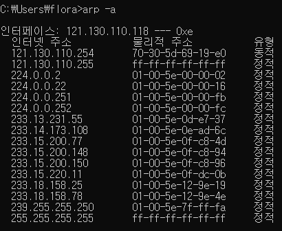
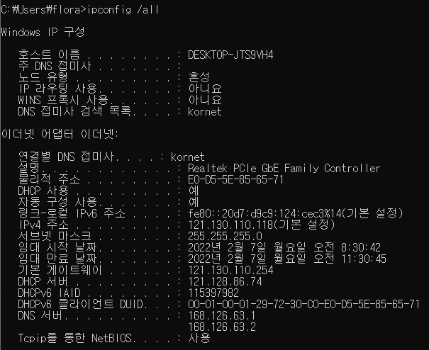
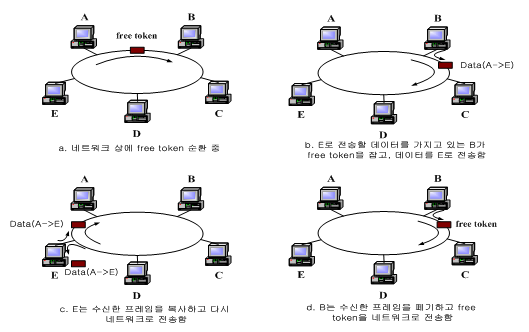
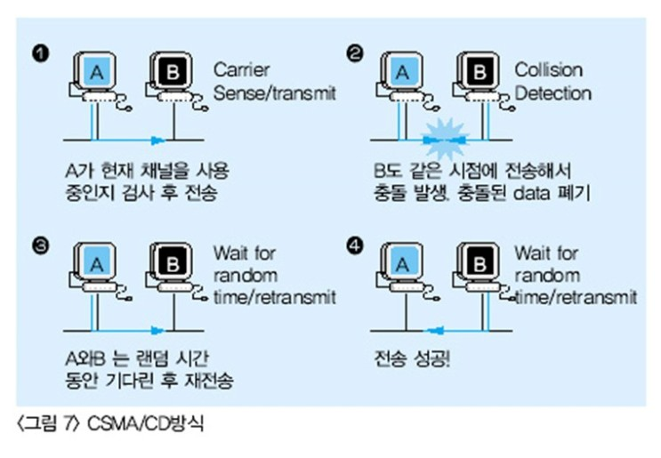
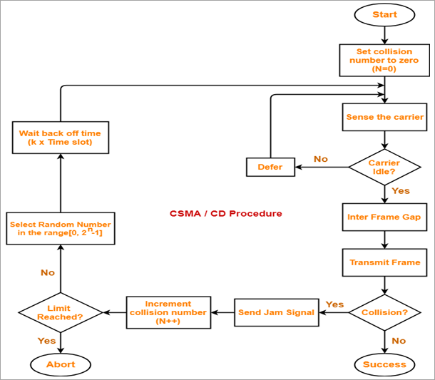
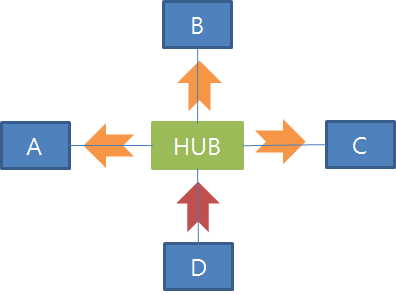
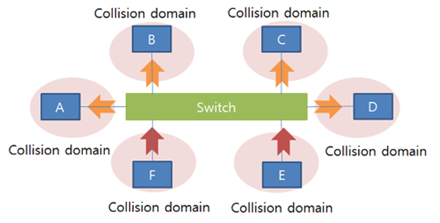
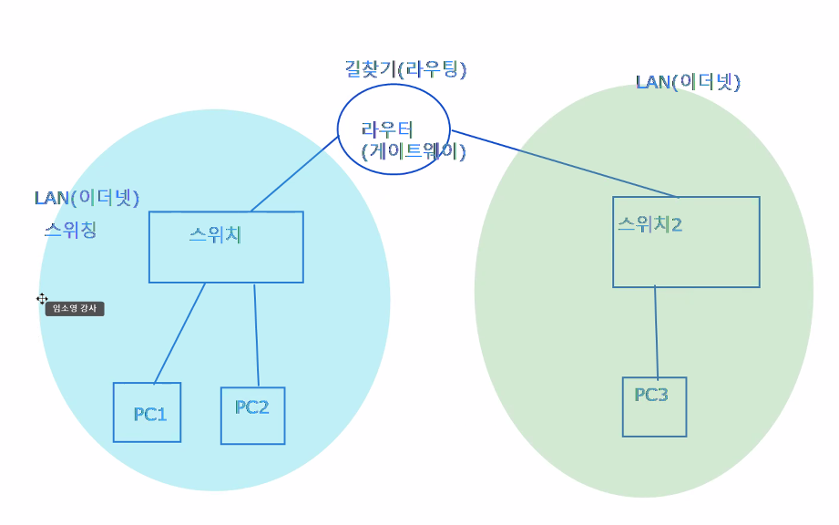

- 인터넷
- 프로토콜
    - 통신규약
- 인트라넷
    - 회사 내부망
- 엑스트라넷
    - 협력기업도 사용할 수 있는 인터넷망
- 규모에 따른 네트워크
    - PAN(Personal Area Network - 무선)
    - LAN
    - MAN
    - WAN
- LAN규모에서 사용하는 프로토콜  - 이더넷
    - 케이블연결
    - network adapter 장착
    - address(유일)
        - Physical Address : network adapter 제조할 때 부여
            - 스위칭을 하기 위한 목적
            - MAC address (Media Access Control Address)
            - 16진수로 표현(한 글자가 4bit)
            - 길이 : 6byte (48bit)
            - IPv6 주소의 일부분으로 사용하기도 함
            - 리눅스에서 확인할 때는 -(하이픈)이 아니라 :(클론)으로 표기됨
            - LAN카드 주소
                - 제조사 코드 24bit + 일련번호 24bit
                98-83-89  -    9B-49-F9
                OUI 		제품일련번호
        - Logical Address
            - IP Address
            - 인터넷을 하기 위한 목적
        - ARP (Cisco 네트워킹 책 38p)
            - Logical Address에 대한 Physical Address를 알아오기 위해 사용하는 프로토콜
            - 보통 같은 망에 있는 기기에 보냄
            - ARP흐름
                - ARP 요청 메시지 - 나는 Y인데, Z야, 너의 mac주소가 뭐니?
                    - ethernet header
                    보내는사람(source) Y mac주소
                    받는사람(destination)  모두 받으세요.
                    FF-FF-FF-FF-FF-FF 브로드캐스트 (방송용)
                - Z만 받아서 요청에 대한 응답 메시지를 생성 - Z인 나는 mac주소 ~이야
                    - ethernet header
                    src : Z mac주소
                    dst : Y mac주소
            - cmd > arp -a (arp cache table 확인)
                
                
                
        - RARP (Reverse ARP)
            - Physical Address에 대한 Logical Address를 알아오기 위해 사용하는 프로토콜
        - cmd > ipconfig /all
            
            
            
    - CSMA/CD
- 프로토콜 방식
    - 토큰 링 방식
        - 충돌을 줄이기 위한 방법
        - 한번에 한기기만  통신이 가능함. 나머지 대기
            
            
            
    - CSMA/CD(Carrier Sense Multiple Access/Collision Detetion)
        
        
        
        
        
        - 현재  이 방식은 스위치 연결 시에는 사용하지 않음
            - 스위치
                - 허브와 달리 MAC주소를 이용해 원하는 장치에만 데이터를 전송해주는 장치
                - 콜리전 도메인을 나눌 수 있어 콜리전 문제를 극복할 수 있음
            - 허브
                - 연결된 모든 장치들에게 데이터를 뿌려주는 장치
                - CSMA/CD 방식을 사용하기 때문에 콜리전(충돌)이 발생해 네트워크가 불안정하고 많은 장치들을 연결하는데 제약이 있으며 보안성 또한 떨어짐
                - 허브의 한계점을 극복하기 위해 나온 장치가 스위치
            - 콜리전 도메인
                - 메세지 전송 시 충돌이 일어나는 영역
                - 허브
                    - D가 메세지를 보내고 있을 때 A, B, C는 아무런 통신을 못함
                        
                        
                        
                - 스위치
                    - 스위치는 각각 포트가 콜리전 도메인을 가짐
                    
                    
                    
    - FDDI
        - 링구조
        - 광케이블로 이중화
    - WAN 사설망
        - 우리나라에서는 공인망 또는 공인망에서 VPN을 사용하기 때문에 거의 사용하지 않음
        - PPP
        - Frame-relay
        - ATM
    - 프로토콜에 필요한 정보
        - 서비스
            - DNS이름해석, 웹 HTTP, HTTPS, 메일 SMTP, POP3, IMAP, 원격접속 Telnet, SSH , 자동IP할당 Bootp, DHCP 등
        - 전송방식
            - 신속 UDP, 정확 TCP
        - 주소방식
            - **IP**, IPX, Apple talk 등
        - 스위칭방식
            - LAN (토큰링,**이더넷**, FDDI )  ,  WAN (SLIP, PPP, Frame-Relay, ATM) 등
- 라우팅
    
    
    

- 캐스트
    - destination address에 어떤 주소를 넣느냐에 따라 다름
    - Unicast
        - 1:1
    - Broadcast
        - 1:all(방송용)
        - 장점
            - 하나의 데이터에 dst주소에 broadcast address 사용하여 전달, 네트워크 장비가 모두에게 전달해줌
        - 단점
            - 수신하기 싫어도 수신을 해야함
        - broadcast address
            - 모든 bit가 1인 주소
                - MAC
                    - FF-FF-FF-FF-FF-FF
                - IP
                    - 255.255.255.255
    - Multicast
        - 1:다수
        - 메세지 1개 생성
        - dst주소에 multicast address 넣어서, 네트워크 장비가 원하는 node에게만 전달을 해줌
        - 네트워크 장비가 누가 원하는지 목록을 가지고 있어야 함 (IGMP)